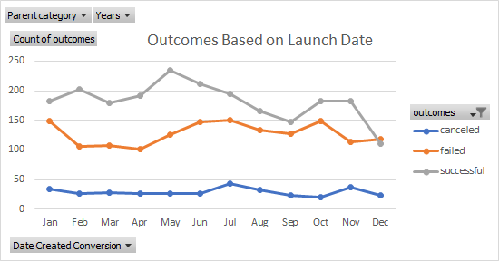

# Kickstarting with Excel
## OVERVIEW OF PROJECT
### **PURPOSE** 
	The aim of this report is to examine deeply about Louise’s fundraising plan. This project will focus on outcomes of the campaign which is based on two criteria: launch dates and goals. The outcome might be successful, failed, cancelled or live. The report will show the relation between each criterion and its outcome to examine any issues or challenges in this campaign and how this plan can be improved to achieve the best result. 
## **ANALYSIS AND CHALLENGES**
### **Analysis of Outcomes Based on Launch Date**

In general, the chart reveals information about the outcomes of the plan: successful, live, failed or cancelled. Number of successful events is the highest among these four; especially in May when it reached the peak of 234 events. However, it went down sharply in the next three year and kept going down after a slight rise. 
The figure of failed outcomes dropped slightly in the beginning until April where it increased slowly up to October before going down. Besides, the numbers of cancelled outcomes remained low and mostly unchanged. The live events were held only on three first months so there is not many information about this figure.
It shows that Louise’s campaign got supported at the beginning; however, issues might occur which affect the outcome. From May, successful results were decreased while failed ones experience an increase.

### **Analysis of Outcomes Based on Goals**

In this chart, there are only three criteria including percentage of successful, failed and cancelled outcomes. This figure shows a little difference from the other one that it generally shows the portion of successful is increasing throughout the year and just experienced a slight drop at the nearly end before it reached the peak at 100% successful campaign. 
Meanwhile, the percentage failed comes higher than the successful one at the beginning; however, it was going down slowly until it dropped significantly to 0% after a slight increase.
There is one more significant interchange between failed and successful outcome which is the goal from 35000 – 44999. There should be more information to figure out the reason why there exist this transformation. However, it seems like the campaign is more successful if the Goals is higher.

### **Challenges and Difficulties**
In the first chart, there are two months that both outcomes (successful and failed) increases where it should be different. If there are more successful events, the number of failed ones should be decreased. Therefore, it is a challenge for analyst to explain this situation and more information is required to figure what issues occurred. 

According to the second chart, it is challenging to get the meaning or conclusion from this data set. Such as, there is a question why the percentage failed is high when the goal is among 35000-44999, then it dropped suddenly to 0 when the goal is from 45000-49999. Thus, this analysis needs more information to figure out the connection between the goal and the outcome. 

## **RESULTS**

*	**What are two conclusions you can draw about the Theater Outcomes by Launch Date?**

1.	The campaign seems more successful in the first half of the year and reducing its success during the second half. Therefore, theatre might be trendy in the beginning of the year. 
2.	Most of the events in theatre category are held without any cancellation.

* **What can you conclude about the Outcomes based on Goals?**
It needs more information and deeper analysis to make a suitable conclusion. The significant point of this figure is that there is a big gap in percentage of successful and failed outcomes when the goal is between 40000-49999. Another thing is that it seems the portion of successful outcome is increasing along with higher goals except some outliers. 

* **What are some limitations of this dataset?**
This dataset shows every single information of the campaign. However, for data analyst, it is too much and hard to examine to turn these data into a better insight to analyse. The huge amount of data makes it difficult to keep track with significant data as well as creating the data anomalies.  Instead, these data should be broken down and focused only on important segments.
In this dataset, the analyst cannot know which category returns the most benefits and during which time should the campaign be held. The data should add the different amount between goal and pledge.
Moreover, there are many currency so it is hard to keep track and they all use $ as currency tag while in England they might use £ instead of the $. So, if the data only show $, it will store wrong information and make problems when doing accounting for the campaign. 

* **What are some other possible tables and/or graphs that we could create?**
As this data has a lot of information, therefore it should be broken down into small sheets or tables to see the relationship among these tables with specific criteria. More graphs such as outcomes based on Years or based on country. As mentioned above, there should show differences between goals and pledges. 

